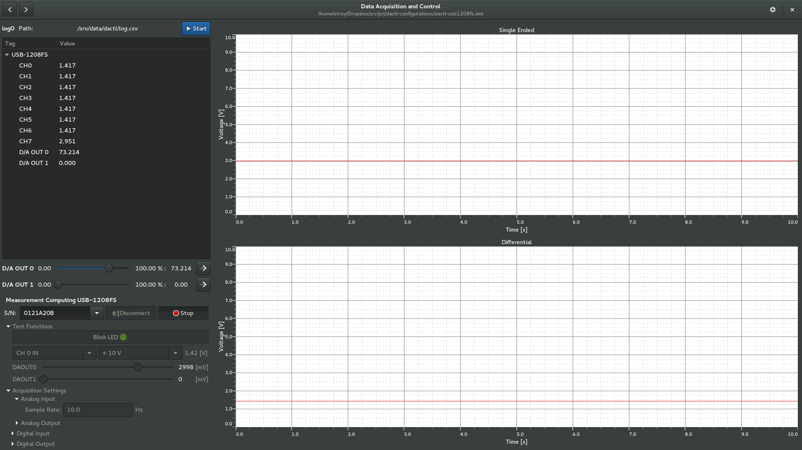

## Dactl Configuration for Measurement Computing USB-1208FS

This configuration file works with the [Dactl]https://github.com/coanda/dactl data
acquisition and control application and the [plugin interface](https://github.com/coanda/dactl-mcc-plugin).
It will allow you to use the Measurement Computing USB-1208FS data acquisition
device to control analog outputs and display analog inputs on a graph.



### Instructions

1. Follow the [installation instruction](https://github.com/coanda/dactl-mcc-plugin)
   to get all the required software components.

2. Copy the dactl.xml file and then run the application as follows.

```bash
dactl -f path_to_file/dactl.xml
```
### Operating Instructions

1. Select the serial number of the device from the dropdown list on the left.
2. Click the "Connect" button.
3. Expand the "Test Functions" section.

  - Click the "Blink LED" button to verify the connection.
  - Select an input channel and range to test the inputs.
  - Use the sliders to change the analog output voltages.

4. Expand the "Acquisiton Settings" section to change the sampling rate.
5. Click the "Acquire" button to transfer control of the device to the main
   application.
6. Use the sliders to control the outputs. These controls are for the Dactl
   channels associated with the outputs which differs from those in the test
   functions where the device is being controlled directly.
7. Click in the channel tree view entries on the left to highligh a trace.
8. Double click on a chart to change the settings.
9. Click the "Start" button to begin logging the data to a file. You will need
   to create the /srv/data/dactl directory with read/write access.

### Contact Info

geoff.johnson@coanda.ca

stephen.roy@coanda.ca
