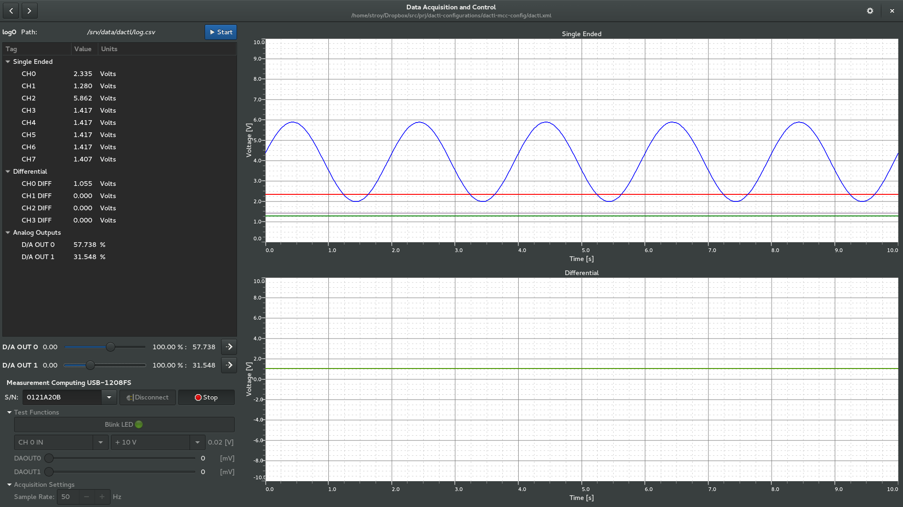

## Dactl Configuration for Measurement Computing USB-1208FS

This configuration file is for the [Dactl]https://github.com/coanda/dactl data
acquisition and control application. It will allow you to us a
Measurement Computing USB-1208FS dataacquisition device to control analog outputs
and display analog inputs on a graph.

